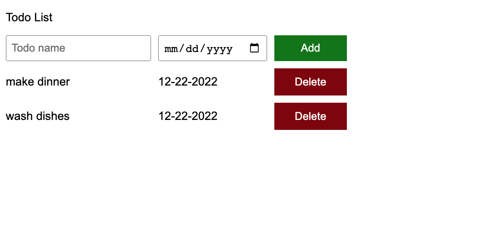

# todo-list

> Simple todo-list. Write a task inside the 'Todo name' input and pick the due date. Press 'Add' button to add the task with the due date specified. Delete the tasts that are completed!

---

## Link to the Todo-list App

[Todo-list](https://eunjistewart.github.io/todo-list/)

---

## Screen Shots (images)

---

## Technologies Used

- JavaScript
- HTML
- CSS

---

## Getting Started

1.  Go to the Todo-list App
    [Link](https://eunjistewart.github.io/todo-list/)
2.  Write a task inside the 'Todo name' input.
3.  Pick the due date.
4.  Press 'Add' button to add the task with the due date specified.
5.  Delete the tasts that are completed and/or if the tasks are no longer relevant.

---

## Next Steps

### (Planned Future Enhancements)

- update CSS on layout & button

---

##### Created as a project in the Super Simple Dev Lessons By Eunji Lee, 2023
